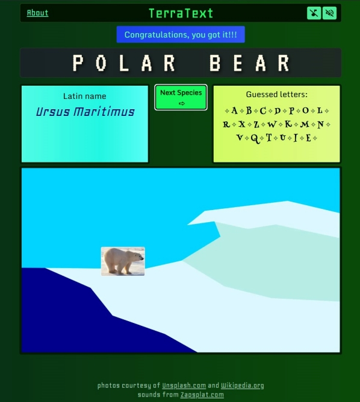

## **TerraText** is a habitat-themed trivia word game that runs in the browser 🐻‍❄️ 

#### The project is written in `TypeScript` using `React` and `Next.js` with `Postgres` via `Supabase`. For styling I used `CSS Modules`.

#### Play TerraText in the wild at [https://terratext.vercel.app/](https://terratext.vercel.app/)

------------

#### To run the project locally:
1. Clone the repo:  
`git clone https://github.com/JBiondi/terratext.git`

2. Install dependencies:  
`pnpm install`

3. Create a `.env.local` file and set up the following environment variables (requires database access).    
`NEXT_PUBLIC_SUPABASE_URL=supabase_url_will_go_here`  
`NEXT_PUBLIC_SUPABASE_ANON_KEY=supabase_key_goes_here`  
`SUPABASE_URL=supabase_url_again`
`SUPABASE_SERVICE_ROLE_KEY=supabase_service_role_key_goes_here`  

4. Run the development server:  
`pnpm dev`
